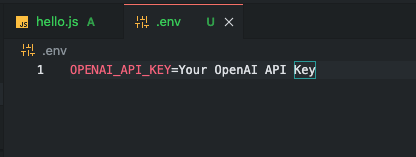
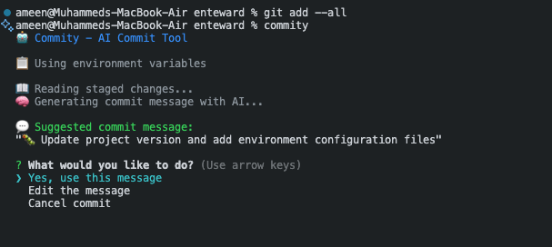
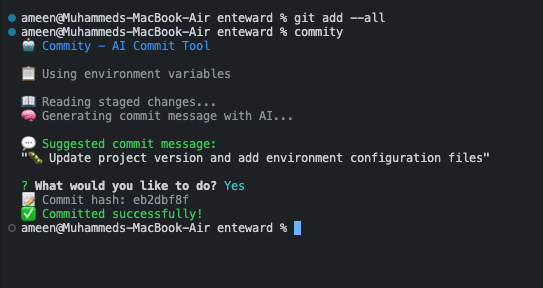

# 🤖 Commity

> **AI-powered Git commit messages with dynamic emoji selection**

A lightweight CLI tool that reads staged Git changes and uses OpenAI to generate intelligent commit messages with appropriate emojis.




*Add your OpenAI API key to the .env file*



*Run the commity command in terminal*



*View the AI-generated commit message and successful commit*

## ✨ Features

- 🧠 **AI-Powered**: Uses OpenAI GPT models for intelligent commit messages
- 🎯 **Dynamic Emojis**: Automatically selects appropriate emojis based on changes
- ⚡ **Lightning Fast**: Simple CLI interface, no complex setup
- 🔒 **Secure**: API key stored locally in `.env` file
- 💬 **Interactive**: Confirm, edit, or cancel generated messages
- 🎨 **Beautiful Output**: Colored CLI with clear feedback

## 🚀 Quick Start

### 1. Install
```bash
npm install -g commity-ai-commit-tool
```

### 2. Setup API Key
```bash
echo "OPENAI_API_KEY=sk-your-api-key-here" > .env
```
Get your API key from [OpenAI Platform](https://platform.openai.com/api-keys)

### 3. Use
```bash
git add <files>
commity
```

## 📋 Example Usage

```bash
# Stage your changes
git add .

# Generate commit message
commity

# Output:
🤖 Commity - AI Commit Tool
📖 Reading staged changes...
🧠 Generating commit message with AI...

💬 Suggested commit message:
"🐛 Fix authentication validation and error handling"

? What would you like to do?
❯ Yes, use this message
  Edit the message  
  Cancel commit

✅ Committed successfully!
```

## 🎯 Emoji Examples

The tool automatically selects emojis based on your changes:

- ✨ **Features**: New functionality, additions
- 🐛 **Bug Fixes**: Error corrections, issue resolutions  
- 📚 **Documentation**: README, docs, comments
- ⚡ **Performance**: Optimizations, speed improvements
- ♻️ **Refactoring**: Code restructuring, improvements
- 🧪 **Testing**: Test files, specs, coverage
- ⚙️ **Configuration**: Settings, env files, configs
- 🔒 **Security**: Authentication, vulnerabilities
- 🎨 **UI/UX**: Styling, design changes
- 🗄️ **Database**: Schema changes, migrations
- 🔌 **API**: Endpoints, routes, services
- 🚀 **Deployment**: CI/CD, builds, deployment
- 📦 **Dependencies**: Package updates, installations

## ⚙️ Configuration

### Environment Variables

| Variable | Description | Default |
|----------|-------------|---------|
| `OPENAI_API_KEY` | Your OpenAI API key (required) | - |
| `OPENAI_MODEL` | OpenAI model to use | `gpt-4o-mini` |

### Supported Models

- `gpt-4o-mini` (default, fastest and most cost-effective)
- `gpt-4o`
- `gpt-4-turbo`
- `gpt-3.5-turbo`

## 🔧 Troubleshooting

**"OpenAI API key not found"**
- Create `.env` file with your API key
- Get your key from [OpenAI Platform](https://platform.openai.com/api-keys)

**"No staged changes found"**
- Use `git add <files>` to stage changes first

**"Not in a Git repository"**
- Run `git init` to initialize a repository

## 🛠️ Development

### Project Structure
```
commity/
├── cli-wrapper.js   # Main CLI entry point
├── ai.js           # OpenAI API integration
├── git.js          # Git operations
├── prompt.js       # CLI user interactions
├── package.json    # Dependencies and scripts
└── README.md       # This file
```

### Contributing

We welcome contributions! Please feel free to submit a Pull Request.

1. **Fork the repository**
2. **Create your feature branch** (`git checkout -b feature/amazing-feature`)
3. **Commit your changes** (`git commit -m 'Add amazing feature'`)
4. **Push to the branch** (`git push origin feature/amazing-feature`)
5. **Open a Pull Request**

### Issues

Found a bug or have a feature request? [Open an issue](https://github.com/muhd-ameen/Commity/issues)!

## 📄 License

This project is licensed under the MIT License - see the [LICENSE](LICENSE) file for details.

## 🙏 Acknowledgments

- Built with ❤️ using OpenAI's GPT models
- Inspired by the need for better commit messages
- Thanks to all contributors and users!

---

**Made with ❤️ by [Muhammad Ameen](https://github.com/muhd-ameen)**